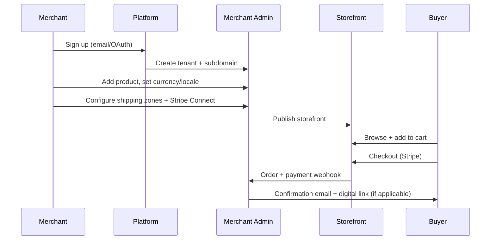
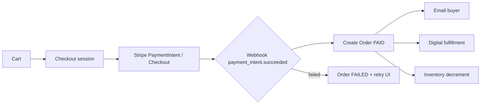

# UGCLab Store — глобальная SaaS-платформа для интернет-магазинов

Мультитенантная **global-first** платформа: предприниматели из любой страны регистрируются, создают магазин без кода и продают покупателям по всему миру — физические и цифровые товары. Модель продукта близка к [Shopify](https://www.shopify.com) и [Sellfy](https://sellfy.com), с расчётом на международный рынок с первого дня (языки, валюты, налоги, доставка, compliance).

**Merchant** получает: мультиязычную витрину, каталог, глобальный checkout, заказы и аналитику. **Платформа** получает: подписки в основной валюте биллинга (USD/EUR), опциональную комиссию с GMV и единый super-admin.

> Продукт не привязан к одному региону: инфраструктура, платежи и юридические процессы проектируются для работы в Европе, Северной Америке, LATAM, APAC и других рынках по мере подключения провайдеров и налоговых правил.

## Содержание

- [Для кого продукт](#для-кто-продукт)
- [Возможности](#возможности-mvp--рост)
- [Global-first](#global-first-принципы-и-scope)
- [Сценарии использования](#сценарии-использования)
- [Цифровые товары](#цифровые-товары-sellfy-стиль)
- [Архитектура](#архитектура)
- [Монетизация платформы](#монетизация-платформы)
- [Приоритет рынков v1](#приоритет-рынков-v1)
- [Сравнение с конкурентами](#сравнение-с-конкурентами)
- [Метрики продукта](#метрики-продукта)
- [Стек и структура репо](#рекомендуемый-стек-черновик)
- [Дорожная карта](#дорожная-карта)
- [Безопасность](#безопасность-и-compliance-глобальные-ориентиры)
- [Разработка](#локальная-разработка-будет-дополнено)
- [Глоссарий](#глоссарий)

---

## Для кого продукт

| Сегмент | Потребность | Что даём |
|---------|-------------|----------|
| **Создатели контента** | Продажа курсов, preset, шаблонов | Digital delivery, защищённые ссылки, простой checkout |
| **Малый e-commerce** | Витрина без разработки | Темы, каталог, доставка по странам, Stripe |
| **Бренды D2C** | Свой домен, бренд, аналитика | Custom domain, настройки витрины, заказы |
| **Агентства** | Несколько магазинов клиентов | Multi-store на одном аккаунте (фаза 2+) |

**Позиционирование:** «Shopify по простоте запуска + Sellfy по digital» — один продукт, глобально, без обязательного кода.

**Отличия (целевые):** быстрый онбординг (менее 15 минут до первого товара), прозрачные тарифы, сильный digital out-of-the-box, единая global checkout-линия, без перегруза enterprise-функциями на старте.

---

## Возможности (MVP → рост)

### Для владельца магазина (merchant)

| Область | MVP | Далее |
|--------|-----|-------|
| **Онбординг** | Регистрация (email/OAuth), страна merchant, поддомен (`brand.platform.com`) | Свой домен (CNAME), KYC по требованию Stripe |
| **Локализация** | EN + 1–2 языка витрины; валюта магазина; форматы даты/чисел | Полный i18n админки, RTL, авто-язык по браузеру |
| **Витрина** | Темы, каталог, SEO (hreflang, meta) | Редактор блоков, региональные landing |
| **Товары** | Физические и цифровые, варианты, остатки | Коллекции, подписки, geo-цены (позже) |
| **Заказы** | Статусы, email на языке покупателя | Экспорт, интеграции перевозчиков (DHL, FedEx, локальные API) |
| **Оплата** | Stripe: карты, Apple/Google Pay в поддерживаемых странах | Local payment methods (iDEAL, BLIK и др. через Stripe), PayPal |
| **Налоги и доставка** | Зоны доставки по странам; flat rate | Stripe Tax / ручные ставки VAT; расчёт по весу |
| **Настройки** | Логотип, бренд, базовая валюта, политики (Privacy, Refund) | Мультивалютный display checkout, market-specific legal |
| **Аналитика** | GMV в валюте магазина, заказы по стране | Воронка, валютная отчётность для платформы |

### Для платформы (super-admin)

- Управление тарифами и подписками merchant'ов
- Модерация магазинов (при необходимости)
- Глобальные метрики: MRR, активные магазины, GMV
- Биллинг платформы (Stripe Billing / аналог)

### Для покупателя (end customer)

- Витрина на языке магазина (и опционально выбор языка)
- Checkout в валюте магазина с прозрачными итогами (товар, доставка, налог)
- Оплата привычными методами в своей стране (через Stripe)
- Личный кабинет: заказы, скачивание digital, счета/receipts

---

## Global-first: принципы и scope

Платформа проектируется как **один продукт для всего мира**, а не как локальный сервис с последующей «интернационализацией».

| Область | Подход |
|--------|--------|
| **Языки** | UI платформы и админки — EN по умолчанию; витрина merchant настраивает языки контента. Строки через i18n (`next-intl` / аналог), не хардкод в компонентах. |
| **Валюты** | У магазина **базовая валюта** (цены, отчёты). Checkout может показывать ту же валюту; конвертация для покупателя — фаза 2+ (FX, риски). Сверка с Stripe в валюте settlement. |
| **Платежи** | **Stripe** (+ **Stripe Connect** для выплат merchant) — глобальное покрытие; подключение local methods по странам merchant. Подписка платформы — USD/EUR. |
| **Налоги** | MVP: merchant задаёт ставки / зоны; рост: **Stripe Tax** или TaxJar для VAT/GST/sales tax по юрисдикциям. |
| **Доставка** | Зоны по **странам и регионам**; весовые правила; позже — API перевозчиков и таможня (DDP/DAP — документировать в FAQ). |
| **Время** | Все timestamps в **UTC** в БД; отображение в timezone магазина и покупателя. |
| **Данные** | Primary region (EU или US) для БД; CDN для статики и digital globally (**Cloudflare** / edge). Data residency — по запросу enterprise (фаза 3+). |
| **Compliance** | GDPR, UK GDPR, CCPA/CPRA (ориентиры), cookie consent, DPA с merchant, право на удаление данных покупателя. |
| **Поддержка** | Документация и статус-страница на EN; тикеты async (email/in-app), без привязки к одному часовому поясу команды. |
| **Маркетинг сайта** | Лендинг платформы: EN + локализация ключевых рынков по приоритету трафика. |

**Non-goals на старте (глобально):** собственный FX-банк, офлайн POS, маркетплейс «все продавцы в одной витрине», полноценный таможенный брокер в MVP.

---

## Как это работает (модель Shopify / Sellfy)

```
┌─────────────────────────────────────────────────────────────────┐
│                     Платформа (один продукт)                     │
│  Маркетинг · Регистрация · Тарифы · Super-admin · API            │
└────────────────────────────┬────────────────────────────────────┘
                             │
         ┌───────────────────┼───────────────────┐
         ▼                   ▼                   ▼
   ┌───────────┐       ┌───────────┐       ┌───────────┐
   │ Магазин A │       │ Магазин B │       │ Магазин C │
   │ (tenant)  │       │ (tenant)  │       │ (tenant)  │
   └─────┬─────┘       └─────┬─────┘       └─────┬─────┘
         │                   │                   │
         ▼                   ▼                   ▼
   Витрина + админка    Витрина + админка    Витрина + админка
   для покупателей      для покупателей      для покупателей
```

**Мультитенантность:** каждый магазин изолирован по данным (`tenant_id`). Один деплой приложения обслуживает всех merchant'ов; маршрутизация по поддомену или custom domain.

**Два интерфейса на tenant:**

1. **Storefront** — публичный сайт магазина (покупатели).
2. **Merchant Admin** — панель владельца (товары, заказы, настройки).

**Платформа** — отдельное приложение или раздел: лендинг, регистрация, биллинг подписки merchant'а.

---

## Сценарии использования

### Merchant: от регистрации до первой продажи



### Покупатель: цифровой товар

1. Открывает витрину `brand.ugclab.store` (или custom domain).
2. Оплачивает в валюте магазина.
3. Получает email со ссылкой на скачивание (signed URL, срок действия).
4. В личном кабинете — повторное скачивание в пределах лимита.

### Super-admin: контроль платформы

- Просмотр списка tenants, статус подписки, GMV.
- Блокировка магазина при нарушении ToS.
- Refund/chargeback visibility (через Stripe Dashboard + внутренние флаги).

---

## Цифровые товары (Sellfy-стиль)

| Функция | MVP | Позже |
|---------|-----|-------|
| Загрузка файлов (PDF, ZIP, video) | ✓ | Лимиты по тарифу |
| Signed download URLs | ✓ | IP/device limits |
| Лимит скачиваний / срок ссылки | ✓ | — |
| Лицензионные ключи | — | ✓ |
| Pay what you want | — | ✓ |
| Embed «Buy button» на внешний сайт | — | ✓ |
| Membership / recurring digital | — | ✓ (Stripe Billing) |
| Watermark / DRM video | — | Enterprise |

Физические и цифровые товары могут быть в **одном магазине**; checkout единый.

---

## Архитектура

### Мультитенантность (решение v1)

| Подход | Выбор | Почему |
|--------|-------|--------|
| БД на tenant | ✗ | Дорого в ops на старте |
| Schema per tenant | ✗ | Сложные миграции |
| **Shared DB + `tenant_id`** | **✓** | Баланс стоимости и скорости; row-level фильтрация везде |

Правила:

- Каждая таблица с данными магазина содержит `tenant_id` (NOT NULL, index).
- Middleware резолвит tenant по `Host` → кэш в Redis (фаза 2).
- Prisma middleware / repository layer — автоматическая подстановка `tenant_id`.
- Super-admin запросы — отдельный контекст без tenant scope.

### Резолв tenant

```
Запрос → Host header
  ├─ app.ugclab.com        → Platform (marketing, billing)
  ├─ admin.ugclab.com      → Merchant Admin (session → tenant)
  ├─ {slug}.ugclab.store   → Storefront (tenant by slug)
  └─ custom domain         → Storefront (tenant by Domain mapping)
```

### Поток оплаты (checkout)



- **Idempotency:** `Idempotency-Key` на создание checkout; webhook обрабатывается один раз (`stripe_event_id` unique).
- **Суммы:** хранить в minor units (cents); валюта ISO 4217.

### Фоновые задачи

| Задача | Инструмент (черновик) |
|--------|------------------------|
| Email (order confirm, download) | Inngest / BullMQ |
| Webhook retry | Queue + dead letter |
| Генерация превью / resize images | Worker |
| Abandoned cart (фаза 2) | Scheduled job |
| Индексация поиска | Async (Meilisearch позже) |

### Наблюдаемость

- **Sentry** — ошибки frontend/backend.
- **Structured logs** — `tenantId`, `orderId`, `requestId`.
- **Audit log** — смена цены, refund, смена домена (merchant admin).
- **Status page** — uptime платформы и checkout (Better Stack / Instatus).

---

## Монетизация платформы

| Источник | Описание |
|----------|----------|
| **Подписка** | Ежемесячно/ежегодно в USD или EUR (Stripe Billing) |
| **Комиссия с GMV** | % с транзакции на Starter (опционально) |
| **Add-ons** | Extra storage, staff seats, custom domain на низком тарифе |

**Кто платит Stripe fees:** на Growth/Pro — merchant; на Starter — можно включить в комиссию платформы (продуктовое решение).

**Stripe Connect:** merchant onboarding (KYC) → charges на connected account → platform fee (`application_fee_amount`) при комиссии.

**Trial:** 14 дней Pro без карты или с картой — A/B на запуске.

---

## Приоритет рынков v1

Первая волна checkout и Connect (ориентир, уточняется по Stripe Dashboard):

| Регион | Страны (примеры) | Заметки |
|--------|------------------|---------|
| **Северная Америка** | US, CA | Основной GMV на старте |
| **Европа** | UK, DE, FR, NL, ES, IT, PL | VAT — ручные ставки в MVP, Stripe Tax позже |
| **Океания** | AU, NZ | EN-локаль уже покрыта |
| **Волна 2** | LATAM, APAC (SG, JP), MENA | Local methods, больше KYC-сценариев |

Языки платформы v1: **EN**. Витрина merchant: **EN + ES + DE** (контент merchant, UI переводится постепенно).

---

## Сравнение с конкурентами

| Критерий | Shopify | Sellfy | Gumroad | **UGCLab Store** (цель) |
|----------|---------|--------|---------|-------------------------|
| Физические товары | ★★★ | ★ | ★ | ★★ (MVP+) |
| Digital native | ★★ | ★★★ | ★★★ | ★★★ |
| Global / multi-currency | ★★★ | ★★ | ★★ | ★★★ (roadmap) |
| Простота старта | ★★ | ★★★ | ★★★ | ★★★ |
| Кастомизация витрины | ★★★ | ★★ | ★ | ★★ → ★★★ |
| App ecosystem | ★★★ | ★ | ★ | ★ (фаза 3 API) |
| Цена для малого бизнеса | $$ | $ | % | $ (конкурентно) |

---

## Метрики продукта

| Метрика | Описание | North Star (ориентир) |
|---------|----------|------------------------|
| **GMV** | Объём оплаченных заказов всех tenants | Рост месяц к месяцу |
| **Active merchants** | Магазин с ≥1 оплатой за 30 дней | Удержание |
| **MRR** | Подписки платформы | Устойчивый SaaS |
| **Checkout conversion** | Sessions → paid orders | Оптимизация воронки |
| **Time to first product** | Регистрация → первый товар | медиана менее 10 минут |
| **Churn** | Отмена подписки merchant | &lt; целевого % по тарифу |

Дашборды: super-admin (платформа), merchant admin (свой магазин).

---

## Маркетинг и рост merchant (roadmap)

| Инструмент | Фаза |
|------------|------|
| SEO (sitemap, meta, Open Graph) | 1 |
| Discount codes | 2 |
| Abandoned cart email | 2 |
| UTM / campaign tracking | 2 |
| Gift cards | 3 |
| Affiliate / referral | 3 |
| Blog / CMS страницы | 2 |
| Email marketing интеграции (Klaviyo, Mailchimp) | 3 |

---

## Рекомендуемый стек (черновик)

| Слой | Вариант | Зачем |
|------|---------|--------|
| **Frontend** | Next.js (App Router) | SSR витрин, SEO, один код для платформы и storefront |
| **Backend** | Next.js API / отдельный NestJS или Hono | REST или tRPC для админки и витрин |
| **БД** | PostgreSQL | Надёжность, JSON для настроек темы |
| **ORM** | Prisma | Миграции, типизация |
| **Auth** | Clerk / Auth.js / Supabase Auth | Регистрация merchant + покупатели (опционально отдельно) |
| **Платежи** | Stripe Connect | Оплата на стороне merchant + подписка платформе |
| **Файлы** | S3 / Cloudflare R2 | Изображения товаров, цифровые файлы |
| **Email** | Resend / SendGrid | Транзакционные письма, локализованные шаблоны |
| **i18n** | next-intl | Языки витрины и платформы, hreflang |
| **Налоги** | Stripe Tax (фаза 2+) | Авто-расчёт VAT/GST/sales tax |
| **CDN / edge** | Cloudflare / Vercel Edge | Быстрая витрина и выдача digital по миру |
| **Хостинг** | Vercel + managed Postgres (Neon/Supabase, EU/US region) | Глобальный деплой, выбор региона БД |
| **Очереди** | Inngest / BullMQ + Redis | Webhooks, email, jobs |
| **Observability** | Sentry + Axiom / Datadog | Ошибки и логи |
| **Поиск** | PostgreSQL FTS → Meilisearch | Каталог на витрине |

**Реализовано в репо:** Next.js 15, Prisma, NextAuth, Tailwind 4, Turborepo.

---

## Планируемая структура репозитория

```
ugclab-devs/
├── apps/
│   ├── platform/          # Лендинг, регистрация, тарифы, super-admin
│   ├── api/               # Hono REST API (merchant admin, auth)
│   ├── merchant-web/      # React + Vite merchant admin (рекомендуется)
│   ├── merchant-admin/    # Legacy Next.js merchant admin
│   └── storefront/        # Публичная витрина по tenant (или dynamic [tenant])
├── packages/
│   ├── database/          # Prisma schema, миграции
│   ├── ui/                # Общие компоненты (кнопки, формы, таблицы)
│   ├── tenant/            # Резолв tenant по host, middleware
│   ├── i18n/              # Словари, локали, форматирование валют/дат
│   └── config/            # ESLint, TypeScript, env-валидация
├── docs/
│   ├── adr/               # Architecture Decision Records
│   ├── api/               # OpenAPI / tRPC contracts
│   └── compliance/        # GDPR, DPA templates
└── README.md
```

Монорепозиторий (Turborepo или pnpm workspaces) — удобно для общих типов и UI между витриной и админкой.

---

## Ключевые сущности данных (черновик)

```
Platform
  └── SubscriptionPlan (Free / Pro / Business)

Tenant (Store)
  ├── User (owner, staff — позже)
  ├── Product (+ variants, inventory, digital asset)
  ├── Collection
  ├── Order (+ line items, payment, fulfillment status)
  ├── Customer (покупатель магазина)
  └── StoreSettings (theme, domain, defaultLocale, currencies[], shippingZones[], taxSettings)

PlatformUser (merchant account)
  └── country, timezone, payoutAccount (Stripe Connect)
  └── может владеть несколькими Tenant (опционально)
```

---

## Тарифы (пример для продукта)

| План | Цена | Лимиты |
|------|------|--------|
| **Starter** | Бесплатно / trial | N товаров, поддомен, комиссия с продаж, базовые страны доставки |
| **Growth** | $/мес (USD/EUR) | Custom domain, больше языков, Stripe Tax |
| **Pro** | $/мес | Staff, API, приоритет, расширенная аналитика по рынкам |

Биллинг merchant — **международные карты**; цены публично в USD с локализованным display (опционально). Конкретные цифры — на этапе go-to-market.

---

## Дорожная карта

### Фаза 0 — Основа (текущий этап)
- [x] README и видение продукта
- [x] Scaffold монорепо (Turborepo + npm workspaces)
- [x] Схема БД (Prisma) — `packages/database`
- [x] Auth merchant (NextAuth) + регистрация на platform
- [x] Apps: `platform` :3000, `merchant-admin` :3001, `storefront` :3002

### Фаза 1 — MVP merchant (global baseline)
- [ ] CRUD товаров (физ + цифровые), базовая валюта магазина
- [ ] i18n витрины (EN + extensible locales), UTC в БД
- [ ] Зоны доставки по странам, checkout (Stripe, major markets)
- [ ] Тема витрины v1, SEO + hreflang заготовка
- [ ] Заказы в админке + локализованные transactional emails

### Фаза 2 — Платформа как бизнес
- [ ] Тарифы и подписка merchant'а
- [ ] Поддомены и резолв tenant
- [ ] Super-admin: список магазинов, метрики

### Фаза 3 — Рост (глобальное масштабирование)
- [ ] Custom domains + SSL automation
- [ ] Stripe Connect (multi-country payouts), local payment methods
- [ ] Stripe Tax, расширенные carrier integrations
- [ ] Мультивалютный display checkout (без обязательного multi-currency settlement)
- [ ] Темы, drag-and-drop, Webhooks / API
- [ ] Data residency options, enterprise SLA

---

## Безопасность и compliance (глобальные ориентиры)

- **Изоляция tenant:** `tenant_id` в каждом запросе к БД; RBAC для staff
- **PCI DSS:** карты только через Stripe; SAQ A при использовании hosted checkout
- **GDPR / UK GDPR:** lawful basis, DPA с merchant как processor, экспорт/удаление данных субъекта, retention policy
- **CCPA/CPRA (США):** do-not-sell/share по применимости; privacy notice на витрине
- **Cookie consent:** баннер на витрине (EU/UK обязательно); аналитика — opt-in где требуется
- **Sanctions & AML:** следовать правилам Stripe Connect; блокировка запрещённых категорий товаров
- **Rate limiting** на checkout и публичном API; защита от card testing
- **Юридические шаблоны:** ToS/Privacy платформы (EN) + рекомендации merchant для своих политик

---

## Локальная разработка

### Требования

- Node.js 20+, npm 10+
- **PostgreSQL** — один из вариантов:
  - **[Neon](https://neon.tech)** (облако, без Docker) — см. [docs/DATABASE-WINDOWS.md](docs/DATABASE-WINDOWS.md)
  - Установщик PostgreSQL для Windows
  - Docker: `docker compose up -d` (если установлен Docker Desktop)

### Быстрый старт

```bash
npm install
cp .env.example .env
# Укажите DATABASE_URL в .env (Neon или localhost — см. docs/DATABASE-WINDOWS.md)
npm run db:push
npm run db:seed
npm run verify:demo
npm run dev
```

### Merchant admin (React + Vite + Hono API)

Рекомендуемый стек для панели магазина — без Next.js:

```bash
npm run dev:react
```

| App | URL |
|-----|-----|
| Merchant admin (Vite) | http://localhost:3001 |
| API (Hono) | http://localhost:4000 |

Скопируйте `apps/merchant-web/.env.example` → `apps/merchant-web/.env` при необходимости. В корневом `.env` нужны `DATABASE_URL`, `AUTH_SECRET`, опционально `API_PORT=4000`.

### Platform admin (для фаундеров / SUPER_ADMIN)

```bash
npm run dev:platform-admin
```

| App | URL |
|-----|-----|
| Platform admin | http://localhost:3003 |
| API | http://localhost:4000 |

**Вход:** `founder@ugclab.store` / `founder1234` (создаётся в `npm run db:seed`)

Экраны: обзор GMV, список магазинов, suspend/activate, планы, пользователи.

Legacy Next.js admin (тот же порт 3001 — не запускайте вместе с `dev:react`):

```bash
npm run dev:admin
```

| App | URL |
|-----|-----|
| Platform (marketing) | http://localhost:3000 |
| Platform admin | http://localhost:3003 |
| Merchant admin | http://localhost:3001 (React) или legacy Next |
| Storefront | http://localhost:3002?tenant=demo |

**Демо:** `demo@ugclab.store` / `demo1234`

### Окружения

| Env | Назначение |
|-----|------------|
| `development` | Локально, Stripe test mode, seed tenants |
| `staging` | Preview deploy, E2E против test Stripe |
| `production` | Live keys, мониторинг, бэкапы БД |

### Качество кода (после scaffold)

- **Unit:** Vitest — pricing, tax zones, tenant scope.
- **E2E:** Playwright — регистрация → checkout → webhook (Stripe CLI).
- **CI:** GitHub Actions — lint, typecheck, test, preview URL на PR.

### ADR (запланировать)

| # | Тема |
|---|------|
| 001 | Shared DB multitenancy + `tenant_id` |
| 002 | Stripe Connect vs direct charges |
| 003 | i18n: next-intl, default locale strategy |
| 004 | Digital asset storage and signed URLs |

---

## Переменные окружения (черновик)

| Переменная | Назначение |
|------------|------------|
| `DATABASE_URL` | PostgreSQL |
| `NEXTAUTH_SECRET` / auth provider keys | Сессии |
| `STRIPE_SECRET_KEY` | Платежи |
| `STRIPE_WEBHOOK_SECRET` | Webhooks |
| `S3_*` или `R2_*` | Медиа и цифровые товары |
| `RESEND_API_KEY` | Email |
| `PLATFORM_URL` | Базовый URL платформы |
| `STOREFRONT_BASE_DOMAIN` | Например `*.ugclab.store` |
| `DEFAULT_LOCALE` | `en` — fallback платформы |
| `STRIPE_CONNECT_*` | Onboarding и payouts merchant по странам |
| `APP_REGION` | `eu` / `us` — регион primary БД и compliance defaults |
| `REDIS_URL` | Очереди, кэш tenant resolution |
| `SENTRY_DSN` | Ошибки production |

---

## Глоссарий

| Термин | Значение |
|--------|----------|
| **Tenant** | Один магазин (изолированный контур данных) |
| **Merchant** | Владелец аккаунта платформы, управляет tenant |
| **Storefront** | Публичная витрина для покупателей |
| **GMV** | Gross Merchandise Value — сумма заказов до вычетов |
| **MRR** | Monthly Recurring Revenue — подписки на платформу |
| **Connect** | Stripe Connect — выплаты merchant и split платежей |
| **Settlement** | Валюта, в которой Stripe зачисляет средства merchant |
| **Processor** | UGCLab как обработчик данных покупателей от имени merchant (GDPR) |

---

## Лицензия

Проприетарный продукт. Уточнить лицензию перед публикацией кода.

---

## Контакты и вклад

Проект в стадии инициализации.

**Следующий шаг:** scaffold монорепозитория, Prisma schema, ADR-001 (multitenancy).

**Вклад (когда откроется репо):**

- Ветки: `main` (prod), `develop`, feature/`issue-123-short-name`
- Commits: [Conventional Commits](https://www.conventionalcommits.org/) (`feat:`, `fix:`, `docs:`)
- PR: описание, скриншот UI, чеклист (тесты, i18n keys, tenant isolation)

Вопросы и предложения — через Issues в репозитории (когда будет создан).
